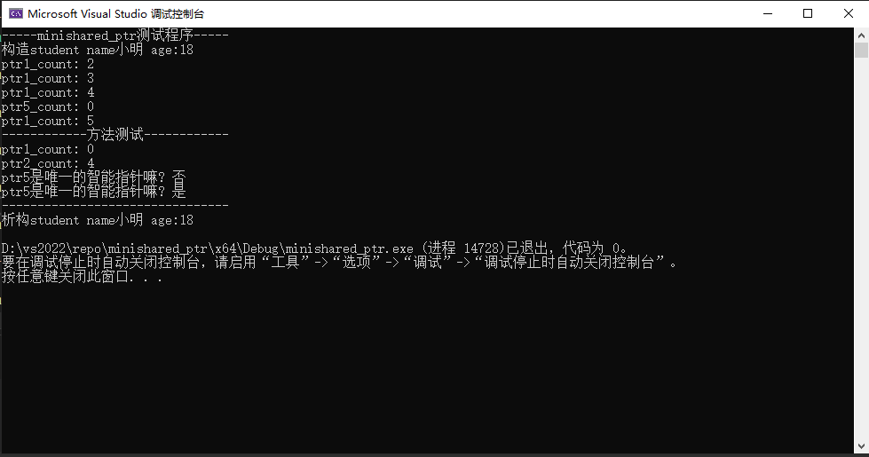
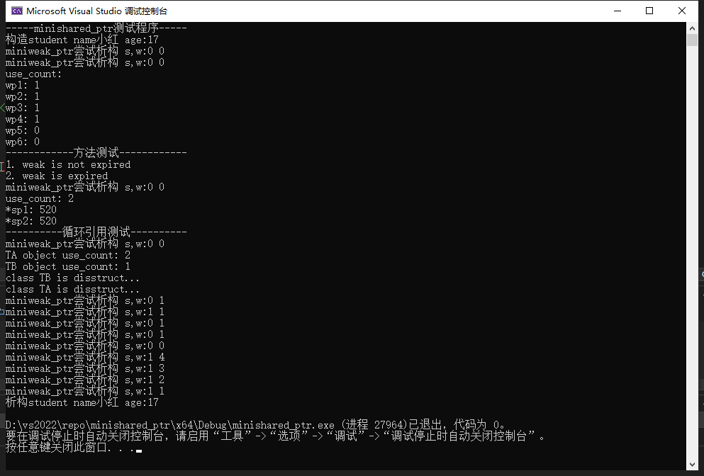
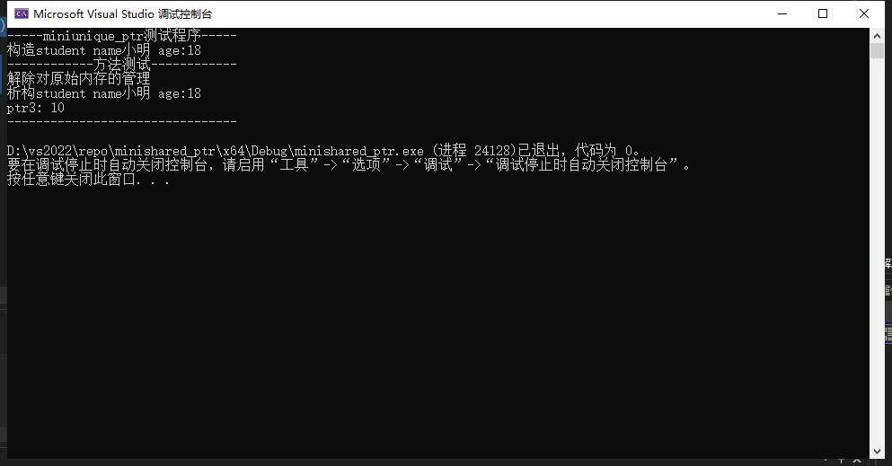

# miniSmartpointers

## 实验背景

在C++中没有垃圾回收机制，必须自己释放分配的内存，否则就会造成内存泄漏，解决这个问题最有效的方法是使用智能指针（smart pointer）。**智能指针式存储指向动态分配（堆）对象指针的类，用于生存期的控制，能够确保在离开指针所在域时，自动地销毁动态分配的对象，防止内存泄漏。智能指针的核心实现技术是引用计数，每使用它一次，内部引用计数加1，每析构一次内部的引用计数减1，减为0时，删除所指向的堆内存。**<a href="#ref1">1</a>

C++11中提供了三种智能指针，使用这些智能指针时需要引用头文件<memory>：

- std::shared_ptr：共享的智能指针
- std::unique_ptr：独占的智能指针
- std::weak_ptr：弱引用的智能指针，它不共享指针，不能操作资源，是用来监视 shared_ptr 的。

## 实验目的

实现简单版本的C++智能指针，通过该实验，加深对于三种智能指针的工作原理、模板和对象的声明周期的理解。

## 实验概述

1. 对于shared_ptr，我们实现了以下内容：
   - 通过构造函数、拷贝构造函数（同时允许shared_ptr和weak_ptr）和拷贝赋值函数（允许右值赋值）初始化
   - 引用计数，当计数为0时，删除智能指针所指向的堆内存
   - reset()方法的重置功能（不包括初始化功能）
   - get()方法：获取原始指针
   - use_count()方法：获取引用计数的值
   - unique()方法：检查当前shared_ptr持有的对象是不是该对象的唯一持有者（C++17废弃，C++20移除）
   - 模拟指针的 * 符号 和 -> 符号
2. 对于weak_ptr，我们实现了以下内容：
   - 通过构造函数、拷贝构造函数（同时允许shared_ptr和weak_ptr）和拷贝赋值函数初始化
   - reset()方法：清空对象，使其不监测任何资源
   - lock()方法：获取管理所监测资源的shared_ptr对象
   - expired()方法：判断观测的资源是否已经被释放
   - use_count()方法：获得当前所观测资源的引用计数
   - 解决shared_ptr循环引用导致的无法析构的问题
3. 对于unique_ptr，我们实现了以下内容：
   - 通过构造函数、拷贝构造函数（允许右值构造，禁止左值构造）和拷贝赋值函数（允许右值赋值，禁止左值赋值）初始化
   - get()方法：获取原始指针
   - reset()方法：清空对象

智能指针还有很多功能在本实验项目中并没有实现，例如**分配器，自定义删除器，引用计数的原子操作**等等

实验代码都来自Github RyanChen-cn用户的分享<a href="#ref2">2</a>

## 实验结果

1. minishared_ptr的测试代码，在minismartptr_test.cpp文件的48-81行，测试结果如下：

   ​            

2. miniweak_ptr的测试代码，在minismartptr_test.cpp文件的83-129行，测试结果如下：

1. miniunique_ptr的测试代码，在minismartptr_test.cpp文件的131-140行，测试结果如下：

## 参考资料

 https://subingwen.cn/cpp/shared_ptr/

 [CppFunction/miniSmartpointers at main · RyanChen-cn/CppFunction (github.com)](https://github.com/RyanChen-cn/CppFunction/tree/main/miniSmartpointers)

